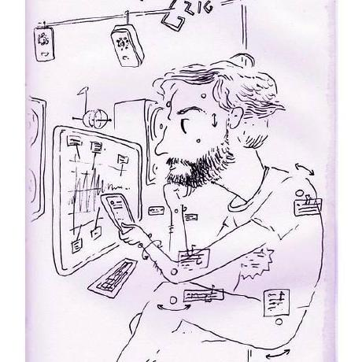

---
#
# By default, content added below the "---" mark will appear in the home page
# between the top bar and the list of recent posts.
# To change the home page layout, edit the _layouts/home.html file.
# See: https://jekyllrb.com/docs/themes/#overriding-theme-defaults
#
layout: home
---

My [research](https://cv.archives-ouvertes.fr/grigore-burloiu) is in interactive music, including [timing](https://github.com/RVirmoors/rolypoly) and [sync](https://github.com/RVirmoors/RVdtw-), [live electronics](https://github.com/RVirmoors/fred-arditti), and [sonification](https://hal.archives-ouvertes.fr/hal-03015480/document).
I teach [creative coding for interactive art](/ccia) at [UNATC](//cinetic.arts.ro/en/echipa/grigore-burloiu/) / [ITPMA](//cinetic.arts.ro/en/itpma/). 

Here's what I'm up to [now](/now).

 

